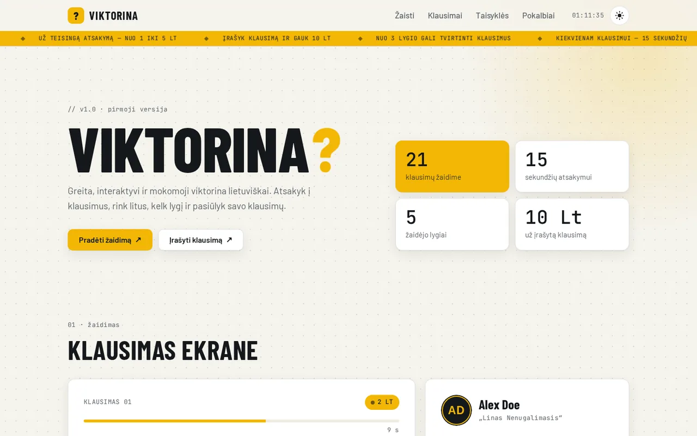

# Viktorina

A fast, interactive quiz game in Lithuanian — answer against the clock, earn litai, level up and submit your own questions.

**[Live demo](https://brutall100.github.io/viktorina-v1/)** · **[Source code](https://github.com/brutall100/viktorina-v1)**



## About

Viktorina ("quiz" in Lithuanian) is my first quiz project, started in 2021. The idea: a quick,
educational quiz where the players also help grow the question bank. Anyone can submit a question,
other players vote on it, and once it has 5 votes a level 3+ player can approve it into the game.

This version keeps the original idea and features and presents them as a clean static site that runs
on GitHub Pages — no server or database needed. Everything the player does is saved in the browser.

## Features

- **Quiz with a timer** — 15 seconds per question, random value of 1–5 Lt, streak counter.
- **Forgiving answers** — case, Lithuanian diacritics and punctuation are ignored (`klaipeda` = `Klaipėda`).
- **Levels 1–5** — litai you earn fill a progress bar and unlock new levels.
- **Question bank** — submit a question (+10 Lt), vote for it, approve it at level 3 (+1 Lt), then play it.
- **Nickname & password generator** — grammatically correct Lithuanian nicknames and a secure password (`crypto.getRandomValues`).
- **Chat demo** — a small chat with the quiz host.
- **Light & dark mode** — follows the system setting, with a toggle that remembers your choice.
- **Live background** — dot grid, pulsing corner glow and a scrolling news ticker (animated with `transform`/`opacity` only).
- **Micro-interactions** — lifting buttons with ripple and a moving ↗ icon, cards that rise, scroll reveals, counting numbers.
- **Accessible** — skip link, visible `:focus-visible`, alt texts, `aria-live` feedback, `prefers-reduced-motion` support.
- **Responsive** — works down to 390 px wide with no sideways scrolling.

## Built with

- HTML5, CSS3 (custom properties, grid, `color-mix`) and vanilla JavaScript
- `localStorage` for progress, `IntersectionObserver` for scroll effects
- Fonts: Barlow Condensed, Barlow and JetBrains Mono (Google Fonts)

## What I learned

- Turning a PHP + MySQL prototype into a static app that works anywhere, with `localStorage` as a small database.
- Building a game loop with `requestAnimationFrame` and a timer bar that animates only `transform`.
- Comparing user answers fairly by normalising text (`String.prototype.normalize("NFD")`).
- Theming with CSS custom properties and `prefers-color-scheme`, plus a saved manual override.
- Writing safe DOM code — user text goes in with `textContent`, never `innerHTML`.

## Run it locally

No build step is needed.

```bash
git clone https://github.com/brutall100/viktorina-v1.git
cd viktorina-v1
npx http-server .   # or just open index.html in a browser
```

## Project structure

```
viktorina-v1/
├── index.html            # page markup
├── css/
│   └── style.css         # design tokens, layout, animations, themes
├── js/
│   ├── theme.js          # applies the saved theme before first paint
│   ├── questions.js      # starting question bank
│   ├── name-generator.js # nickname and password generator
│   └── app.js            # quiz, levels, question queue, chat, effects
├── images/               # favicon and initials avatars (SVG)
└── docs/
    └── screenshot.webp   # README screenshot
```

## Credits

- Fonts: [Barlow, Barlow Condensed](https://fonts.google.com/specimen/Barlow) and [JetBrains Mono](https://fonts.google.com/specimen/JetBrains+Mono) — SIL Open Font License.
- "Alex Doe" is a made-up demo profile; avatars are generated from initials.
- Quiz questions, code and design — my own work.
